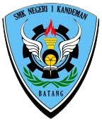

<!DOCTYPE html>
<html lang="IND">
<head>
    <meta charset="UTF-8">
    <meta name="viewport" content="width=device-width, initial-scale=1.0">
    <title>Kelas X - Teknik Ketenagalistrikan</title>
    
</head>
<body>
    <header>
        <h1>KELAS X - TEKNIK KETENAGALISTRIKAN 1</h1>
        
Selamat datang di halaman resmi Kelas X Teknik Ketenagalistrikan 1

    </header>

    <nav>
        <a href="#about">Tentang Kelas</a>
        <a href="#schedule">Jadwal Pelajaran</a>
        <a href="#students">Daftar Siswa</a>
        <a href="#contact">Kontak</a>
        <a href="#dongo">struktur organisasi</a>
    </nav>

    <main>
        <section id="about">
            <h2>Tentang Kelas</h2>
            
Kelas X Teknik Ketenagalistrikan adalah tempat di mana siswa belajar tentang dasar-dasar teknik listrik, instalasi, dan teknologi kelistrikan. Dengan bimbingan guru profesional, siswa dipersiapkan untuk menghadapi tantangan dunia industri modern.

        </section>

        <section id="schedule">
            <h2>Jadwal Pelajaran</h2>
            <table>
                <thead>
                    <tr>
                        <th>Hari</th>
                        <th>Mata Pelajaran</th>
                        <th>Waktu</th>
                    </tr>
                </thead>
                <tbody>
                    <tr>
                        <td>Senin</td>
                        <td>B.ING,GTL,PAI,INFORMATIKA</td>
                        <td>07:00 - 15:30</td>
                    </tr>
                    <tr>
                        <td>Selasa</td>
                        <td>BK,DLE,SEJARAH,PAI</td>
                        <td>07:00 - 15:30</td>
                    </tr>
                    <tr>
                        <td>Rabu</td>
                        <td>B.ING,MTK,PPKN,B.IND,PJOK</td>
                        <td>07:00 - 15:30</td>
                    </tr>
                    <tr>
                        <td>Kamis</td>
                        <td>IPAS,PDE,SBDP,B.IND</td>
                        <td>07:00 - 15:30</td>
                    </tr>
                    <tr>
                        <td>Jumat</td>
                        <td>IPAS,MTK,B.JAWA</td>
                        <td>07:00 - 14:00</td>
                    </tr>
                </tbody>
            </table>
        </section>
        

        <section id="students">
            <h2>Daftar Siswa</h2>
            <table>
                <thead>
                    <tr>
                        <th>No</th>
                        <th>Nama</th>
                    </tr>
                </thead>
                <tbody>
                    <tr>
                        <td>1</td>
                        <td>Adevta Juwita Sari</td>
                    </tr>
                    <tr>
                        <td>2</td>
                        <td>Afan Fadil</td>
                    </tr>
                    <tr>
                        <td>3</td>
                        <td>Ahmad Zanuar Liga</td>
                    </tr>
                    <tr>
                        <td>4</td>
                        <td>Aini Navisatul Izza</td>
                    </tr>
                    <tr>
                        <td>5</td>
                        <td>Alif Adi Irawan</td>
                    </tr>
                    <tr>
                        <td>6</td>
                        <td>Andini Angraini</td>
                    </tr>
                    <tr>
                        <td>7</td>
                        <td>Angelika Fany</td>
                    </tr>
                    <tr>
                        <td>8</td>
                        <td>Anindia Dwi Annisa</td>
                    </tr>
                    <tr>
                        <td>9</td>
                        <td>Arifah Linatun Nafisah</td>
                    </tr>
                    <tr>
                        <td>10</td>
                        <td>Arul Setiawan</td>
                    </tr>
                    <tr>
                        <td>11</td>
                        <td>Birrul Walidayn</td>
                    </tr>
                    <tr>
                        <td>12</td>
                        <td>Dira Adelia Nanda</td>
                    </tr>
                    <tr>
                        <td>13</td>
                        <td>Dyzza Evan Favian</td>
                    </tr>
                    <tr>
                        <td>14</td>
                        <td>Febiyan Eka Listyana</td>
                    </tr>
                    <tr>
                        <td>15</td>
                        <td>Gadizza Ajahru Sifa</td>
                    </tr>
                    <tr>
                        <td>16</td>
                        <td>Gallu Al Prianty</td>
                    </tr>
                    <tr>
                        <td>17</td>
                        <td>Hendrik Prasetyo</td>
                    </tr>
                    <tr>
                        <td>18</td>
                        <td>Isnaini Adzkarul Febriani</td>
                    </tr>
                    <tr>
                        <td>19</td>
                        <td>Karima Rachil Anjani</td>
                    </tr>
                    <tr>
                        <td>20</td>
                        <td>Khalista Ardini</td>
                    </tr>
                    <tr>
                        <td>21</td>
                        <td>Kisna Nabila Safara</td>
                    </tr>
                    <tr>
                        <td>22</td>
                        <td>M Zacky Arifiansyah</td>
                    </tr>
                    <tr>
                        <td>23</td>
                        <td>Muchammad Rangga Ardiansyah</td>
                    </tr>
                    <tr>
                        <td>24</td>
                        <td>Mugiono Santoso</td>
                    </tr>
                    <tr>
                        <td>25</td>
                        <td>Muhamad Herlangga</td>
                    </tr>
                    <tr>
                        <td>26</td>
                        <td>Nazala Maulin Madina</td>
                    </tr>
                    <tr>
                        <td>27</td>
                        <td>Novia Eka Abdillah</td>
                    </tr>
                    <tr>
                        <td>28</td>
                        <td>Rama Raditya Ananda</td>
                    </tr>
                    <tr>
                        <td>29</td>
                        <td>Rifaah Diah Fitri Oktavia</td>
                    </tr>
                    <tr>
                        <td>30</td>
                        <td>Rosslan Yuliyanto</td>
                    </tr>
                    <tr>
                        <td>31</td>
                        <td>Saiful Reffandi Anwar</td>
                    </tr>
                    <tr>
                        <td>32</td>
                        <td>Trisan Rizkia Setiyanto</td>
                    </tr>
                    <tr>
                        <td>33</td>
                        <td>Tumina Eka Jariyah</td>
                    </tr>
                    <tr>
                        <td>34</td>
                        <td>Wahyu Putra Adiansah</td>
                    </tr>
                    <tr>
                        <td>35</td>
                        <td>Wawan Setya Budi</td>
                    </tr>
                    <tr>
                        <td>36</td>
                        <td>Wulandari</td>
                    </tr>
                </tbody>
            </table>
        </section>
        <section id="contact">
            <h2>Kontak</h2>
            
Untuk informasi lebih lanjut, silakan hubungi kami:

            
Email: muhamadherlangga248119@student.smkn1kandeman.sch.id

            
Telepon: (082) 327 370 695

            
Instagram:
                
        </section>
    </main>
    <header>
    <h1>SMKN1KANDEMAN KEC KANDEMAN KAB BATANG JAWA TENGAH</h1>
   </header>
   <headerq> 
    <h1>TEKNIK INSTALASI TENAGA LISTRIK SMKN1KANDEMAN</h1>
   </headerq>
    <footer>
        
&copy; 2025 Kelas X Teknik Ketenagalistrikan 1. Semua hak dilindungi.

    </footer>
</body>
</html>
